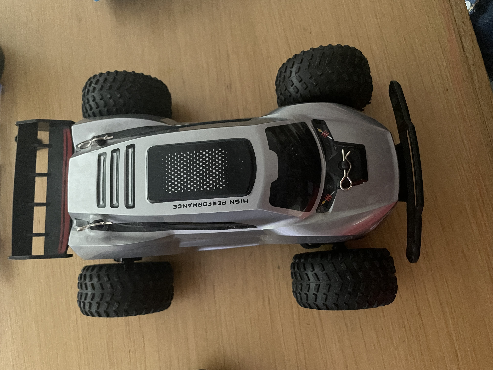
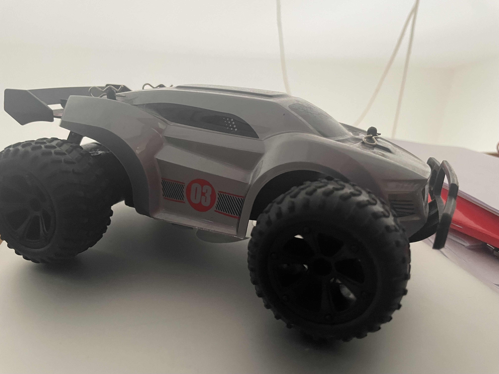
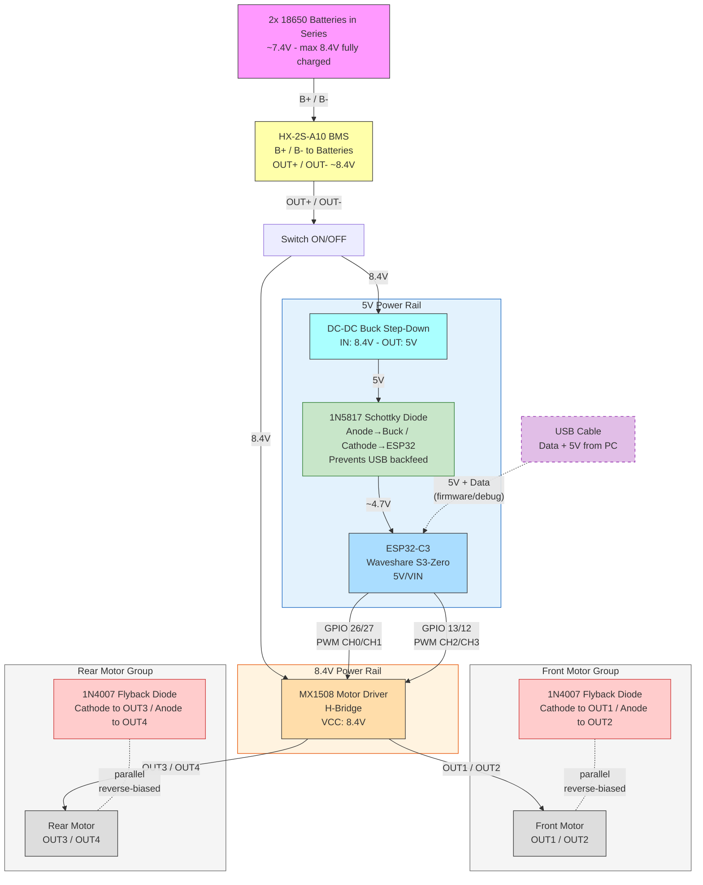
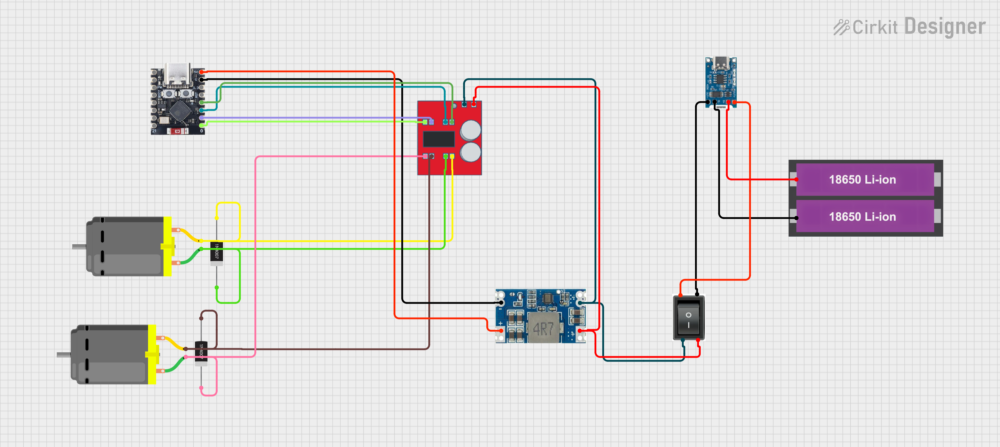
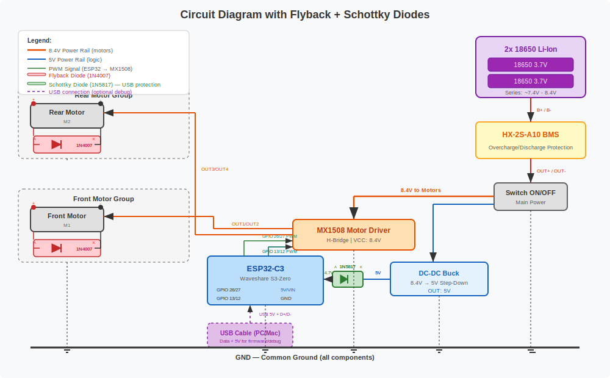
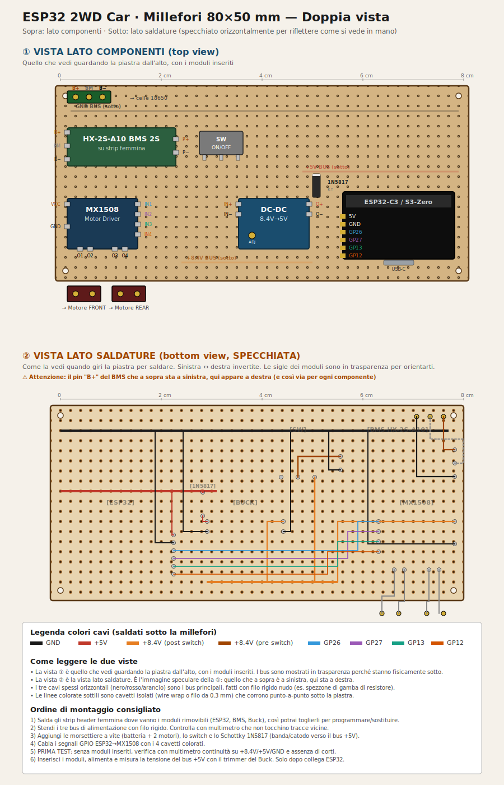

# Esp32 2WD Car Bluetooth
Esp32 2WD Car with Bluetooth Remote Control is an project that can avoid obstacles and learn with your son. This is a second project for build a car. This way we can replace the old main logic from a old toy car.


## Components Details  

- **[ESP32C3](https://www.waveshare.com/wiki/ESP32-S3-Zero)**: For development purposes, we use this board.  

- **MINI L298N(MX1508) Motor Driver**: It controlled the motors with Bridge H circuit. 

- **Switch ON/OFF** It is used for turn on/off the power on circuit.

- **HX-2S-A10 BMS**: Battery Management System for 2S lithium batteries in series. It protects the cells from overcharge, over-discharge and short circuit.

- **DC-DC Buck Step-Down Module (8.4V to 5V)**: It converts the 8.4V output from the 2S battery pack down to 5V to safely power the ESP32 and other logic components.
  
- **Bluetooth GamePad**: It's used to remote command the car.

- **2x 18650 Battery (Rechargeable)**: Connected in series through the HX-2S-A10 BMS, providing approximately 8.4V (fully charged). The BMS handles balancing and protection, then a buck step-down module regulates the voltage to 5V for the logic components.
  
- **Jumper Wires**: Male-to-male and male-to-female connectors for the circuit (any normal wires can be used, though male-to-female connectors are necessary for connecting with esp).

- **Breadboard**: For connection the wires with others components we used this board.

- **Hot glued**: For connection the wires/devices/motors with others components we used this project.
- **Soldering iron**: For connection the wires with others components we used this board.

- **2x 1N4007 Flyback Diodes**: One per motor, soldered in parallel (reverse-biased) across the motor terminals. They protect the MX1508 and the ESP32 from back-EMF voltage spikes generated when the motors brake or reverse direction.

- **1x 1N5817 Schottky Diode**: Placed between the buck converter 5V output and the ESP32 5V/VIN pin (anode to buck, cathode to ESP32). It prevents the battery power from backfeeding into the USB port of your computer when both USB and battery are connected at the same time. This allows safe firmware upload and serial monitoring while the car is powered on.

## Following Hardware Steps

1. I had an old toy car. We connected them using the screw provided with the chassis. Glue gun can be used to attach the motors to the base.

<table>
  <tr>
    <td>
      
    </td>
    <td>
      
    </td>
  </tr>
</table>

2. Uncover the top of the car, take a look on the main board and isolate the power and cable from the motors


3. And repeated the process for the rear motor and connected it to "out3" and "out4" of the motor driver.

4. After that we connected the two 18650 batteries in series through the HX-2S-A10 BMS (output ~8.4V). The BMS output goes to the motor driver positive terminal (12V marked port) to power the motors directly. We also connected the BMS output to a DC-DC buck step-down module that converts 8.4V to 5V. The 5V output from the buck module powers the ESP32 and other logic components. All grounds (battery/BMS, buck module, motor driver, ESP32) are connected together.

5. We connected the ENA, IN1, IN2, IN3, IN4, ENB ports with the ESP32's D32, D26, D27, D13, D12 & D33 no pin respectively.

6. We removed both of the ENA and ENB jumpers so that we can control the speed of the motors using PWM. If anyone doesn't want to control the speed of the motors then they should leave the jumper on the board.

7. Install the Ultrasonic Sensor connect the GND to esp32 GND, VCC to 5V esp32, trig to D5 on esp32 and trigP to D18 on esp32.

8.  Install the Led 5V device with GND to esp32 GND, VCC  to D19 on esp32.

9. Solder a **1N4007 flyback diode** in parallel across each motor terminals (reverse-biased: cathode/band side to the positive terminal, anode to the negative terminal). The MX1508 does not have built-in flyback diodes, so these protect the driver and the ESP32 from voltage spikes caused by back-EMF when the motors stop or change direction.

10. Solder a **1N5817 Schottky diode** on the 5V line between the buck converter output and the ESP32 5V/VIN pin (anode → buck OUT+, cathode/band → ESP32 VIN). This diode isolates the battery power rail from the USB port, so you can safely connect the USB cable for firmware upload or serial debugging while the car is powered on by the batteries. Without this diode, connecting USB and battery at the same time could send current back into your computer's USB port and damage it.

> | Scenario | Batteries | USB | Motors | Serial Monitor |
> |---|---|---|---|---|
> | Firmware upload | OFF | Connected | No | Yes |
> | Debug with motors | **ON** | Connected | **Yes** | **Yes** |
> | Normal operation | ON | Disconnected | Yes | No |


## Circuit Diagram


```mermaid
flowchart TD
    BAT["2x 18650 Batteries in Series\n~7.4V - max 8.4V fully charged"]
    BMS["HX-2S-A10 BMS\nB+ / B- to Batteries\nOUT+ / OUT- ~8.4V"]
    SW["Switch ON/OFF"]

    subgraph POWER_8V ["8.4V Power Rail"]
        MOTOR_DRV["MX1508 Motor Driver\nH-Bridge\nVCC: 8.4V"]
    end

    subgraph POWER_5V ["5V Power Rail"]
        BUCK["DC-DC Buck Step-Down\nIN: 8.4V - OUT: 5V"]
        SCHOTTKY["1N5817 Schottky Diode\nAnode→Buck / Cathode→ESP32\nPrevents USB backfeed"]
        ESP["ESP32-C3\nWaveshare S3-Zero\n5V/VIN"]
    end

    USB["USB Cable\nData + 5V from PC"]

    subgraph FRONT_MOTOR ["Front Motor Group"]
        MOTOR_F["Front Motor\nOUT1 / OUT2"]
        DIODE_F["1N4007 Flyback Diode\nCathode to OUT1 / Anode to OUT2"]
    end

    subgraph REAR_MOTOR ["Rear Motor Group"]
        MOTOR_R["Rear Motor\nOUT3 / OUT4"]
        DIODE_R["1N4007 Flyback Diode\nCathode to OUT3 / Anode to OUT4"]
    end

    BAT -->|"B+ / B-"| BMS
    BMS -->|"OUT+ / OUT-"| SW
    SW -->|"8.4V"| MOTOR_DRV
    SW -->|"8.4V"| BUCK
    BUCK -->|"5V"| SCHOTTKY
    SCHOTTKY -->|"~4.7V"| ESP
    USB -.->|"5V + Data\n(firmware/debug)"| ESP

    ESP -->|"GPIO 26/27\nPWM CH0/CH1"| MOTOR_DRV
    ESP -->|"GPIO 13/12\nPWM CH2/CH3"| MOTOR_DRV

    MOTOR_DRV -->|"OUT1 / OUT2"| MOTOR_F
    MOTOR_DRV -->|"OUT3 / OUT4"| MOTOR_R

    DIODE_F -.-|"parallel\nreverse-biased"| MOTOR_F
    DIODE_R -.-|"parallel\nreverse-biased"| MOTOR_R

    style BAT fill:#f9f,stroke:#333
    style BMS fill:#ffa,stroke:#333
    style BUCK fill:#aff,stroke:#333
    style ESP fill:#adf,stroke:#333
    style MOTOR_DRV fill:#fda,stroke:#333
    style MOTOR_F fill:#ddd,stroke:#333
    style MOTOR_R fill:#ddd,stroke:#333
    style DIODE_F fill:#fcc,stroke:#c33
    style DIODE_R fill:#fcc,stroke:#c33
    style POWER_8V fill:#fff3e0,stroke:#e65100
    style SCHOTTKY fill:#c8e6c9,stroke:#2e7d32
    style USB fill:#e1bee7,stroke:#8e24aa,stroke-dasharray: 5
    style POWER_5V fill:#e3f2fd,stroke:#1565c0
    style FRONT_MOTOR fill:#f5f5f5,stroke:#666
    style REAR_MOTOR fill:#f5f5f5,stroke:#666
```

> **Note:** GND is shared between all components (BMS, Buck Step-Down, MX1508, ESP32-C3).
>
> | ESP32 GPIO | MX1508 Pin | Function |
> |---|---|---|
> | GPIO 26 | IN1 | Front Motor Forward |
> | GPIO 27 | IN2 | Front Motor Backward |
> | GPIO 13 | IN3 | Rear Motor Forward |
> | GPIO 12 | IN4 | Rear Motor Backward |

<table>
  <tr valign="middle">
    <td halign="center">
      
      <div>
        <a href="https://app.cirkitdesigner.com/project/4d7fd9ed-47f0-43c8-8ef2-58eadbf371e6">circuit scheme link</a>
      </div>
    </td>
    <td halign="center">
      
      <div>Circuit with flyback (1N4007) + Schottky (1N5817) diodes</div>
    </td>
  </tr>
</table>

## Internal Control

- The bluetooth car app sends different characters for different functions and the ESP receives them and controls the motors using the L298N motor driver module. 
    - Basic Action :
Up → Up  
Down → Down  
Left → ‘Left’  
Right → ‘Right’

  - Features Action:
B button → 'B'


- Pressed the B Button, stop the car.


## Following Software Steps

### Windows / macOS

1. Download the [Arduino IDE](https://www.arduino.cc/en/software/) and begin to write a simple code to learn how to turn on/off a simple built-in LED inside the ESP32. You can compile and upload the binary on ESP32.
2. After it, follow these [steps](https://www.waveshare.com/wiki/ESP32-S3-Zero#Arduino). Install those libraries on Arduino for ESP32 and Bluetooth controller, in the following list:
   - https://raw.githubusercontent.com/ricardoquesada/esp32-arduino-lib-builder/master/bluepad32_files/package_esp32_bluepad32_index.json
   - https://espressif.github.io/arduino-esp32/package_esp32_index.json
3. If you want to test the RGB LED, please add the library "[Adafruit_NeoPXL8](https://github.com/adafruit/Adafruit_NeoPXL8)" from the Library Manager. In that case, in the folder "code", choose the file named "test_RGB_led.ino".
4. In the end, you can retrieve the code and setup the pin numbers and commands from your BL remote control.

### Linux (Ubuntu/Debian)

1. Install the Arduino IDE via terminal:
   ```bash
   sudo apt update
   sudo apt install -y arduino
   ```
   Alternatively, download the latest [Arduino IDE AppImage](https://www.arduino.cc/en/software/) and run it directly:
   ```bash
   chmod +x arduino-ide_*_Linux_64bit.AppImage
   ./arduino-ide_*_Linux_64bit.AppImage
   ```

2. Add your user to the `dialout` group so you can access the serial port without `sudo`:
   ```bash
   sudo usermod -aG dialout $USER
   ```
   **Log out and log back in** for the group change to take effect.

3. Install the ESP32 and Bluepad32 board packages. Open Arduino IDE, go to **File → Preferences → Additional Board Manager URLs** and add these URLs (comma-separated):
   - `https://raw.githubusercontent.com/ricardoquesada/esp32-arduino-lib-builder/master/bluepad32_files/package_esp32_bluepad32_index.json`
   - `https://espressif.github.io/arduino-esp32/package_esp32_index.json`

   Then go to **Tools → Board → Boards Manager**, search for "esp32" and install it.

4. If you want to test the RGB LED, add the library "[Adafruit_NeoPXL8](https://github.com/adafruit/Adafruit_NeoPXL8)" from **Sketch → Include Library → Manage Libraries**. Then use the file "test_RGB_led.ino" in the "code" folder.

5. Connect the ESP32 via USB. Check the port with:
   ```bash
   ls /dev/ttyUSB* /dev/ttyACM*
   ```
   Select the correct port in **Tools → Port**, then compile and upload.


## Perfboard Build Guide

This section explains how to assemble all the components on an 80×50 mm perfboard (millefori). The SVG below shows two views of the same board:

1. **Component side (top):** What you see looking at the board from above, with the modules inserted. The power buses are drawn semi-transparent because they physically run underneath.
2. **Solder side (bottom):** The same board flipped horizontally — this is important because when you actually flip the board to solder, left and right are swapped. For example, the BMS "B+" pin that sits on the left in the top view will appear on the right when you're soldering.



### Key Notes

- **Use female pin headers** for the BMS, Buck converter, and ESP32 so they remain removable for programming or replacement.
- The three thick horizontal lines (black/red/orange) on the solder side are the main power buses, made with rigid bare wire (e.g., cut resistor legs).
- The thin colored lines are insulated point-to-point wires (wire-wrap or 0.3 mm wire) running under the board.

### Recommended Assembly Order

1. **Solder female pin headers** where the removable modules go (ESP32, BMS, Buck converter).
2. **Lay out the three power buses** (GND, +5V, +8.4V) with rigid wire. Check with a multimeter that they don't touch nearby traces.
3. **Add the screw terminals** (battery + 2 motors), the ON/OFF switch, and the 1N5817 Schottky diode (band/cathode side toward the +5V bus).
4. **Wire the GPIO signals** from ESP32 to MX1508 with the 4 colored wires (GP26→IN1, GP27→IN2, GP13→IN3, GP12→IN4).
5. **Test before inserting any module:** use a multimeter to verify continuity on +8.4V / +5V / GND and make sure there are no shorts between buses.
6. **Insert the modules**, power on, and measure the +5V bus voltage using the Buck converter's trimmer potentiometer. Only after confirming correct voltage, plug in the ESP32.

> **Tip:** If you need exact hole-to-hole distances for positioning the female headers, or a separate wiring-only diagram for the buses, feel free to ask.


## Pictures and Videos
